# Oomp Teardown Remote Control Transmitter Receiver Kit 2.4 GHz 4 Channel GA-4H-TX
This teardown is for the Oomp Teardown.     
OOMP details: https://github.com/oomlout/oomlout_oomp_teardown_remote_control_transmitter_receiver_kit_2_4_ghz_4_channel_ga_4h_tx/tree/main/parts/remote_control_transmitter_receiver_kit_2_4_ghz_4_channel_car_style_grip_black_kit_retail_packaging_aliexpress_ga_4h_tx    
Link AliExpress: https://www.aliexpress.com/item/1005005061265278.html    
Link Amazon: https://www.amazon.co.uk/dp/B0D8686DBH    

[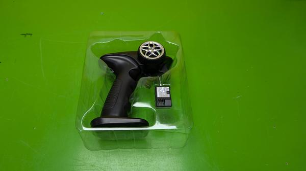](image.jpg)

    

    

    

    

    

    

    

    

    

    

## Steps

### box
**In Box**   
[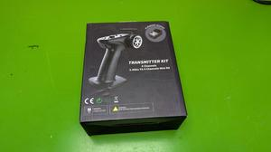](source_files/box.jpg)  
Box photo

### box_1
**Box Left Side**   
[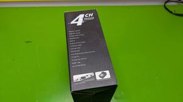](source_files/box_1.jpg)  
Box left side photo

### box_2
**Box Right Side**   
[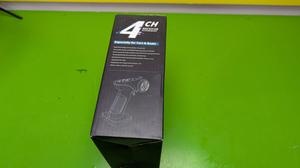](source_files/box_2.jpg)  
Box right side photo

### teardown_1
**Controller Ready to Teardown**   
  
Controller ready to teardown

### teardown_2
**Receiver Ready to Teardown**   
[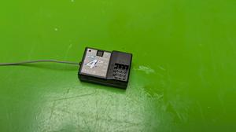](source_files/teardown_2.jpg)  
Receiver ready to teardown

### teardown_3
**Receiver Bottom**   
[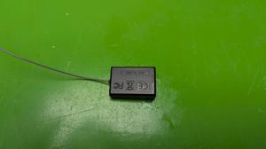](source_files/teardown_3.jpg)  
The bottom of the receiver

### teardown_4
**Receiver Opened**   
[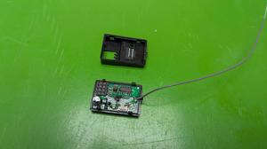](source_files/teardown_4.jpg)  
The receiver opened. Use a sharp point to unclip the clips holding it together

### teardown_5
**Receiver Apart**   
  
The receiver apart. The pcb is held in with glue, pull gently to remove

### teardown_6
**Receiver PCB**   
[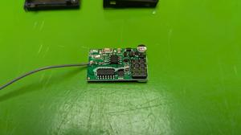](source_files/teardown_6.jpg)  
The receiver PCB

### teardown_7
**Transmitter Ready to Teardown**   
[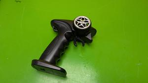](source_files/teardown_7.jpg)  
The transmitter ready to teardown

### teardown_8
**Steering Wheel Removed**   
[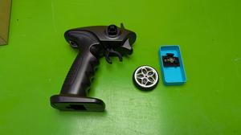](source_files/teardown_8.jpg)  
Steering wheel removed. Unscrew the retaining screw in the middle. Battery box lid easily unlips

### teardown_9
**Transmitter Back Side**   
  
The back side of the transmitter. Remove seven screws to open

### teardown_10
**Transmitter Opened**   
[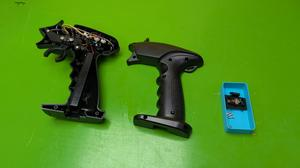](source_files/teardown_10.jpg)  
The transmitter opened.

### teardown 11
**Trigger Removed**   
  
The trigger removed. Unscrew the retaining screw

### teardown 12
**Trigger Unplugged**   
  
The trigger unplugged. Pull gently to remove

### teardown 13
**Wheel Mount Closeup**   
  
The wheel mount closeup

### teardown 14
**Wheel Mount Removed**   
  
The wheel mount removed. Unscrew the retaining screw

### teardown 15
**Wheel Mount Unplugged**   
  
The wheel mount unplugged. Pull gently to remove

### teardown 16
**Battery Box Removed**   
  
The battery box removed.

### teardown 17
**Battery Box Unplugged**   
  
The battery box unplugged. Pull gently to remove

### teardown 18
**Transmitter PCB Removal**   
  
The transmitter PCB removal with top attached.

### teardown 19
**Transmitter PCB Removed Top**   
  
The transmitter PCB removed top photo

### teardown 20
****   
  
The transmitter PCB removed bottom photo

### teardown 21
**Transmitter PCB Removed From Top**   
  
The transmitter PCB removed from top

### teardown 22
**Transmitter PCB With Top Label Beside**   
  
The transmitter PCB with top label beside

### teardown 23
**Transmitter PCB Detail Top**   
  
The transmitter PCB detail top

### teardown 24
**Transmitter PCB Detail Bottom**   
  
The transmitter PCB detail bottom

