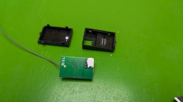

# Oomp Teardown Remote Control Transmitter Receiver Kit 2.4 GHz 4 Channel GA-4H-TX
This teardown is for the Oomp Teardown

    

    

    

    

    

    

    

    

    

    

## Steps

### Step: 
* In Box *  
  
Box photo

### Step: 
* Box Left Side *  
  
Box left side photo

### Step: 
* Box Right Side *  
  
Box right side photo

### Step: 
* Controller Ready to Teardown *  
  
Controller ready to teardown

### Step: 
* Receiver Ready to Teardown *  
  
Receiver ready to teardown

### Step: 
* Receiver Bottom *  
  
The bottom of the receiver

### Step: 
* Receiver Opened *  
  
The receiver opened. Use a sharp point to unclip the clips holding it together

### Step: 
* Receiver Apart *  
  
The receiver apart. The pcb is held in with glue, pull gently to remove

### Step: 
* Receiver PCB *  
  
The receiver PCB

### Step: 
* Transmitter Ready to Teardown *  
  
The transmitter ready to teardown

### Step: 
* Steering Wheel Removed *  
  
Steering wheel removed. Unscrew the retaining screw in the middle. Battery box lid easily unlips

### Step: 
* Transmitter Back Side *  
  
The back side of the transmitter. Remove seven screws to open

### Step: 
* Transmitter Opened *  
  
The transmitter opened.

### Step: 
* Trigger Removed *  
  
The trigger removed. Unscrew the retaining screw

### Step: 
* Trigger Unplugged *  
  
The trigger unplugged. Pull gently to remove

### Step: 
* Wheel Mount Closeup *  
  
The wheel mount closeup

### Step: 
* Wheel Mount Removed *  
  
The wheel mount removed. Unscrew the retaining screw

### Step: 
* Wheel Mount Unplugged *  
  
The wheel mount unplugged. Pull gently to remove

### Step: 
* Battery Box Removed *  
  
The battery box removed.

### Step: 
* Battery Box Unplugged *  
  
The battery box unplugged. Pull gently to remove

### Step: 
* Transmitter PCB Removal *  
  
The transmitter PCB removal with top attached.

### Step: 
* Transmitter PCB Removed Top *  
  
The transmitter PCB removed top photo

### Step: 
*  *  
  
The transmitter PCB removed bottom photo

### Step: 
* Transmitter PCB Removed From Top *  
  
The transmitter PCB removed from top

### Step: 
* Transmitter PCB With Top Label Beside *  
  
The transmitter PCB with top label beside

### Step: 
* Transmitter PCB Detail Top *  
  
The transmitter PCB detail top

### Step: 
* Transmitter PCB Detail Bottom *  
  
The transmitter PCB detail bottom

